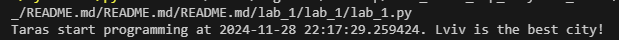
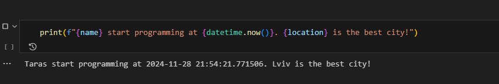
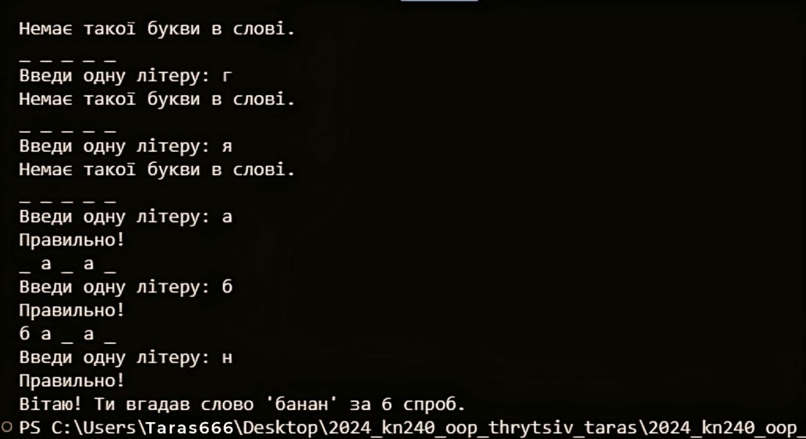

# Звіт до роботи 1

### Тема: _Вступ до курсу. Підготовка робочого середовища та знайомство з Git_

### Мета роботи: _встановити необхідне програмне забезпечення, налаштувати середовище розробки, створити власний репозиторій, опанувати форматування в markdown та оформити звіт._
---

### Хід виконання роботи

* **Результати виконання завдань:**
  1. Було інстальовано Python та Visual Studio Code.
  2. Створено репозиторій за посиланням: [<<<натисни тут>>>](https://github.com/Taras1Thrytsiv2023/2024_kn240_oop_thrytsiv_taras_/blob/main/README.md).
  3. За допомогою ChatGPT підготовлено початкову структуру сторінки.
  4. Ознайомленося з основами Markdown.
  5. Налаштовано середовище розробки: додано плагіни, і було розпочато роботу над першою програмою.

* Першу програму створено у [Python-файлі](lab_1.py). Код було запущено, результат відображено на зображенні нижче:

    

* Продовжено роботу в [Jupyter Notebook](lab_1.ipynb). Результати виконання видно на наступному зображенні:

    

* **Індивідуальне завдання:**
  Поставила запитання ChatGPT про те, яку першу програму він би запропонував. У результаті отримала приклад програми "Вгадай число". Код знаходиться [тут](2.py), а пояснення програми наведено нижче.
---

# Перша програма "Вгадай слово"

## Опис гри:

- Програма вибирає випадкове слово з набору.
- Користувач по черзі вводить букви.
- Якщо буква є в слові, вона відкривається на відповідних місцях.
- Гра триває, поки користувач не вгадає все слово.

## Інструкція щодо запуску:

1. Збережіть код у файлі, наприклад, `lab_1.2.py`.
2. Запустіть файл через термінал або командний рядок.

---

### Результат виконання:

---

### Висновки:

- **Що виконано:** розроблено першу програму та виконано її запуск.
- **Чи досягнуто мети роботи:** так, мету роботи досягнуто.
- **Отримані знання:** ознайомилася з основами Python та роботою в Jupyter Notebook.
- **Чи були відповіді на всі питання:** так, усі питання вирішено.
- **Чи виконано всі завдання:** завдання виконано повністю.
- **Виниклі труднощі:** були незначні труднощі з налаштуванням Python через некоректний шлях.
- **Враження щодо формату:** формат зручний і цікавий.
- **Пропозиції щодо покращення:** немає пропозицій.

---
